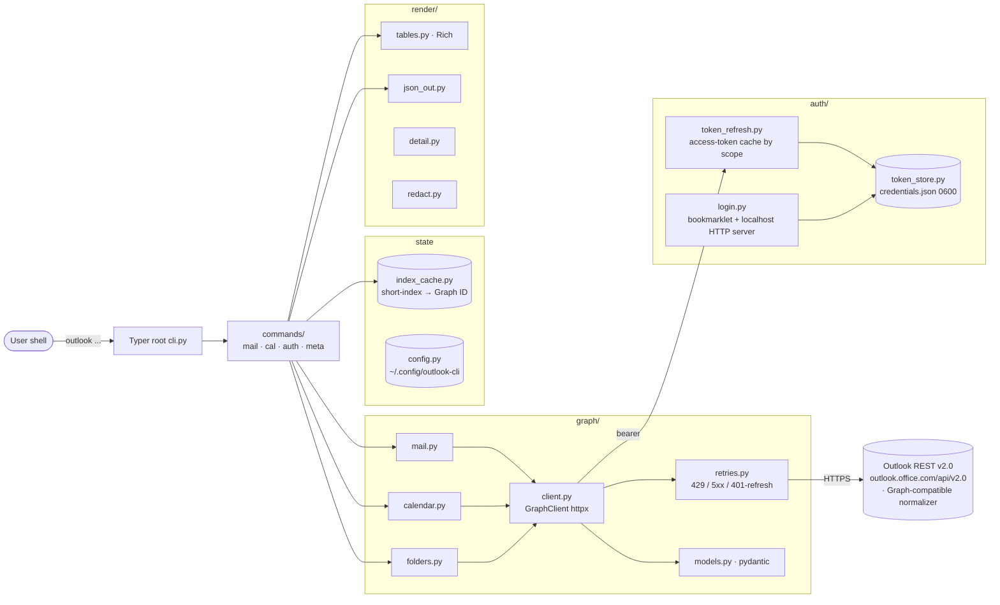

# outlook-cli

**Your Microsoft 365 mail and calendar, in the terminal. No Azure app registration required.**

[](https://www.python.org/downloads/)
[](LICENSE)
[](https://mypy-lang.org/)
[](https://docs.astral.sh/ruff/)

```console
$ outlook mail list --unread --top 5
  #  From              Subject                              Received
  1  Alice Chen        Re: Q3 roadmap review                09:14
  2  build@ci          Nightly failed on main               07:02
  3  Dana Okafor       Lunch Thursday?                      Yesterday

$ outlook mail reply 3 --all        # opens $EDITOR, confirms before sending
$ outlook cal today
```

---

## Why this exists

Most Outlook CLIs die at the login screen: they need an Azure app registration your
tenant admin will never approve, or a headless automation flow that conditional access
blocks on sight.

`outlook-cli` sidesteps that. You sign in once **in your own browser**, through whatever
your tenant demands (federated SSO, smart card, MFA, device compliance), then click a
bookmarklet that hands the resulting session to the CLI. No app registration, no service
principal, no stored password.

| | |
|---|---|
| **Auth** | One-time bookmarklet capture, ~90-day refresh token, rotates on every use |
| **Output** | Rich tables for humans, schema-stable `--json` for pipes and scripts |
| **Indexing** | Short indices (`1`, `2`, `3`) instead of 152-character Graph IDs |
| **Typing** | `mypy --strict` clean, Pydantic models on every response |
| **Agents** | Ships a Claude Code skill so an LLM can drive it safely |

> The CLI targets `outlook.office.com/api/v2.0` by default, because tokens captured from
> the Outlook Web App login flow are consented for that audience. A payload normalizer
> keeps the data models Graph-compatible, and `OUTLOOK_CLI_API_BASE` /
> `OUTLOOK_CLI_API_SCOPE` point it at Microsoft Graph directly if your token allows it.

## Quickstart

```bash
# 1. Install
uv tool install outlook-cli          # or: uv sync --all-extras, inside this repo

# 2. Sign in (one-time). Follow the prompts: make a bookmarklet, open Outlook,
#    sign in, click the bookmarklet.
outlook login

# 3. Read your inbox
outlook mail list --unread --top 10

# 4. Act on a message by its short index
outlook mail read 1
outlook mail reply 1 --all           # opens $EDITOR for the body
outlook mail mark 1 --read
outlook mail move 1 archive

# 5. Check today's calendar
outlook cal today

# 6. Machine-readable output, on any command
outlook --json mail list --unread | jq '.items[].subject'
```

Every command takes `--help` and `--json`. Indices reset per family on each
`list`/`today`, and never collide between mail and calendar.

## Authentication

```bash
outlook login
```

The CLI prints a URL and a one-line JavaScript snippet, then walks you through:

1. **Create a bookmarklet** — drag the provided snippet to your bookmarks bar.
2. **Open** `https://outlook.cloud.microsoft/mail/` in your normal browser and sign in
   however your tenant requires. It's your real browser, so every corporate check passes.
3. **Click the bookmarklet.** It collects the MSAL credential and account entries from
   localStorage — not the whole store, which can grow past the browser's URL length limit —
   and posts them to a temporary localhost server the CLI spins up, which sidesteps the
   page's Content Security Policy.
4. The CLI parses the MSAL refresh token and writes it to
   `~/.config/outlook-cli/credentials.json` (mode `0600` on POSIX).

The refresh token lasts about 90 days and rotates on every use.

```bash
outlook whoami     # print the signed-in account
outlook logout     # delete stored credentials
```

**What's stored, and where:** only the refresh token, tenant ID, client ID and your
username, in `~/.config/outlook-cli/credentials.json`. Short-lived access tokens are
cached separately in `~/.cache/outlook-cli/access_tokens.json`. Nothing is sent anywhere
except Microsoft's own endpoints, and secrets are redacted from verbose logs.

## Commands at a glance

| Group | Commands |
|---|---|
| **Auth** | `login`, `logout`, `whoami` |
| **Mail (read)** | `list`, `read`, `thread`, `search` |
| **Mail (write)** | `send`, `reply`, `forward`, `move`, `delete`, `flag`, `unflag`, `mark` |
| **Calendar (read)** | `today`, `tomorrow`, `week`, `list`, `show`, `find-time` |
| **Calendar (write)** | `create`, `respond`, `cancel` |
| **Meta** | `config get/set/list`, `version`, `--json-schema <name>` |

Run `outlook <group> --help` (e.g. `outlook mail --help`) for the full flag surface.

## Workflows

<details open>
<summary><b>Daily inbox triage</b></summary>

```bash
outlook mail list --unread --top 20
outlook mail read 3                       # short index from the list above
outlook mail reply 3 --all                # opens $EDITOR for the body
outlook mail flag 5 --due "fri"
outlook mail mark 6 --read                # clear unread after handling elsewhere
outlook mail move 7 archive
```
</details>

<details>
<summary><b>Find a meeting time and schedule it</b></summary>

```bash
outlook cal find-time --with alice@example.com,bob@example.com --duration 30m --window "this week"
# [1] Wed May 22 14:00 -> 14:30 (confidence: 100)
# [2] Thu May 23 10:00 -> 10:30 (confidence: 100)

outlook cal create \
  --title "Quick sync" \
  --start "wed 14:00" \
  --duration 30m \
  --invitees alice@example.com,bob@example.com \
  --online
```
</details>

<details>
<summary><b>Pipe into other tools</b></summary>

```bash
# Count unread by sender
outlook --json mail list --unread --all \
  | jq '.items | group_by(.from.address) | map({(.[0].from.address): length}) | add'

# Save every attachment from this week
for idx in $(outlook --json mail list --since 7d | jq '.items[] | select(.has_attachments) | .index'); do
  outlook mail read $idx --save-attachments ./attachments
done
```
</details>

## JSON output and exit codes

Schemas are queryable: `outlook --json-schema mail.list`. Top-level keys freeze at v1.0;
fields may be added, never renamed or removed.

| Code | Meaning |
|---|---|
| `0` | Success |
| `1` | Generic error |
| `2` | Usage error |
| `64` | Not found (ID or index doesn't resolve) |
| `77` | Auth / session expired; run `outlook login` |

Exit `77` is the one to branch on in scripts: it means re-login, not failure.

## Configuration

```bash
outlook config list
outlook config set default_folder archive
outlook config get default_folder
```

Stored at `~/.config/outlook-cli/config.toml`.

## Use it from Claude Code

```bash
./scripts/install-skill.sh
```

This copies `skill/SKILL.md` to `~/.claude/skills/outlook-cli/SKILL.md`. In a fresh
conversation you can then ask:

- "Show me my unread mail."
- "What's on my calendar today?"
- "Find a 30-minute slot with alice@example.com tomorrow."
- "Reply to the email from Bob and say I'll have it by Friday."

The skill tells Claude to confirm with you before anything is sent, and to surface
session expiry instead of retrying blindly.

## Architecture



A small Python 3.11+ package (`src/outlook_cli/`), organized by concern rather than entity:

| Layer | Module | Responsibility |
|---|---|---|
| **CLI** | `cli.py`, `commands/` | Typer root + sub-apps (`mail`, `cal`, `config`, auth verbs). Root callback handles `--json`, `--verbose`, `--json-schema`. |
| **Auth** | `auth/login.py` | Bookmarklet flow: ephemeral localhost server (ports 49152–49252) receives a hash-encoded `localStorage` dump and parses MSAL.js state. |
| **Auth** | `auth/token_store.py` | Pydantic `Credentials` model, `filelock`-guarded atomic write, mode `0600`. |
| **Auth** | `auth/token_refresh.py` | Mints short-lived access tokens, caches by scope, rotates refresh tokens on use. |
| **HTTP** | `graph/client.py` | `httpx.Client` wrapper with bearer injection and an audience-aware key normalizer (PascalCase outbound for Outlook REST, camelCase inbound for Graph compatibility). |
| **HTTP** | `graph/retries.py` | 429 honors `Retry-After`; 5xx exponential backoff with ±20% jitter (3 attempts, capped at 30s); 401 triggers one forced refresh + retry. |
| **HTTP** | `graph/{mail,calendar,folders}.py`, `graph/models.py` | Endpoint calls + Pydantic response models. |
| **State** | `index_cache.py` | Per-family JSON map (`mail`, `cal`) of short index → Graph ID, rewritten on every `list`/`today`. Atomic via `tmp + os.replace`. |
| **Render** | `render/{tables,json_out,detail,redact}.py` | Rich tables for humans, schema-stable JSON for `--json`, secret redaction in logs. |
| **Errors** | `errors.py` | `SessionExpired` → exit 77, `NotFound` → exit 64, `UserError` → exit 1. |

### Token lifecycle

1. `outlook login` captures the MSAL refresh token via the bookmarklet →
   `~/.config/outlook-cli/credentials.json`.
2. Each command calls `token_refresh.get_token(scope)`, which checks the per-scope cache
   (60s skew) and on a miss POSTs the refresh token to the tenant's `/oauth2/v2.0/token`
   endpoint, rotating the stored refresh token atomically.
3. `GraphClient` injects the bearer, runs the request through `with_retries`, normalizes
   keys back to camelCase, and validates into Pydantic models.
4. `cli.main()` catches `SessionExpired` and exits 77, so callers detect a re-login
   without parsing stderr.

### Stack

`typer` (CLI) · `httpx` (HTTP) · `pydantic` v2 (models) · `rich` (tables) · `filelock`
(locking) · `dateparser` + `tzlocal` (natural-language dates) · `html2text` (body
rendering) · `truststore` + `certifi` (corporate-proxy TLS). Built with `uv` +
`hatchling`.

## Development

```bash
uv sync --all-extras
uv run pytest              # 221 tests; coverage gate at 80%
uv run ruff check .
uv run ruff format .
uv run mypy                # strict, over src/
pre-commit install         # ruff + hygiene hooks on every commit
```

Tests use `respx` for HTTP mocking and `syrupy` for snapshots. The `tests/e2e/` suite hits
real Graph and only runs with `OUTLOOK_CLI_E2E=1` plus valid credentials.

## Troubleshooting

**"Session expired".** Run `outlook login`. Refresh tokens last ~90 days, rotate on use,
and a tenant policy can revoke them at any time.

**"Could not bind to a local port".** The login server tries `127.0.0.1` on ports
49152–49252. Check for a firewall blocking local binds.

**Bookmarklet does nothing.** Make sure the active tab is `outlook.cloud.microsoft` when
you click it, not your identity provider's page or `microsoftonline.com`.

**"Unterminated string" while parsing the captured data.** The payload was truncated in
transit. Re-create the bookmark from the *current* `outlook login` output — older versions
dumped all of localStorage, which overflows the browser's URL length limit once the page
accumulates enough app state.

**TLS errors behind a corporate proxy.** `truststore` loads the OS certificate store, so
a proxy's root CA is picked up automatically once it's installed system-wide.

## Contributing

Issues and pull requests welcome. Please keep `uv run pytest`, `uv run ruff check .` and
`uv run mypy` green; `pre-commit install` handles the formatting side for you.

## License

MIT. See [LICENSE](LICENSE).
